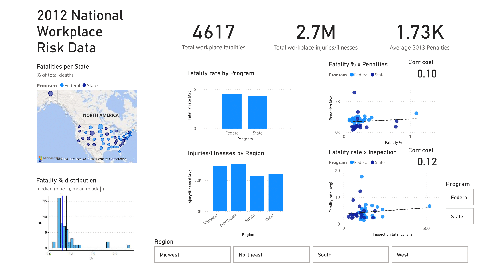

 **Author:** Charles Barnes
  
**Institution:** QuickStart Inc
  
**Active Project Dates:** Feb 26th, 2024 - March 10th, 2024
## Summary
  
Stakeholders in an expanding company want to choose a state for a new headquarters while considering workplace risk management practices in the USA. I conducted exploratory analysis of 2012 state-level workplace fatalities, injury/illness, and inspection program. The analysis included distribution, bar, and scatter plots with slicers on inspection program and USA region. I found that state-run inspection programs overall had less average fatality rate. For USA West, average penalties were lowest and fatality percentage was uncorrelated with penalties. The stakeholders might consider another headquarters in a western state with state-run inspection, like Arizona or Oregon.
  
## Business Problem
  
An expanding company in the manufacturing industry wants to establish headquarters in other states within the United States of America. Their original headquarters is in the Northeast region and they are accustomed to the federal regulations for their industry. However, the owners want to know which regulatory methods, at the state or federal level, are most effective for reducing workplace risk while also *not* imposing penalty amounts that would impair company growth.

For the next headquarters, they are considering two possibilities:
  1. Choose a state similar to their own in another region
  2. Choose a state that is likely to have more effective regulatory practices

This project will begin to address these questions through exporatory analysis of available data. The intended audience for the Power BI dashboard is other data analysts and subject-matter experts who will have insight on the final presentation to key stakeholders.
  
## Data
  
The provided dataset contains state-level information on workplace risk in the USA from 2012, including fatalities, illnesses, and inspection program.

I enhanced the base dataset with the estimated 2012 state population from [Census.gov](https://www.census.gov/data/tables/time-series/demo/popest/2010s-state-total.html) (Under **Datasets**: "Population, Population Change, and Estimated Components of Population Change: April 1, 2010 to July 1, 2019 (NST-EST2019-alldata) [<1.0 MB]").
  
## Methods
  
### Relational data
I made calculated columns to normalize injuries/illness to state population (injuries/illness percent) and fatalities to reported deaths (fatality percent). 

### Plots
#### Distribution
The map reveals geographic location of selected states and an R script histogram reveals the distribution of fatality percent shown in the map.

#### Cards
Top-level cards reveal aggregate numbers for total fatality count, total injury/illness count, and average penalties.

#### Bar
The first bar chart reveals average fatality rate by program with drill-down capability in a program-state hierarchy. The second bar chart contains average injury/illness counts by regions with drill-down capability in a region-state hierarchy.

#### Scatter
I added scatterplots to reveal correlative/predictive qualities associated with workplace inspection. The first plot correlates penalties with fatality percent. The second plot correlates fatality rate with inspection latency (the years required to inspect each workplace). Each plot is fit with a linear regression trendline. I used quick calculations to add correlation coefficients to each plot.

### Interactivity
I added slicer buttons to explore changes by region and program.
  
## Results

Visit the interactive [demo](https://ccb-apps.shinyapps.io/workplace_risk/ "Workplace Risk").

### Distribution
Analysis centered on fatalities because all states have fatality data. Fatality percent was a key feature to describe in the dataset. The geographical distribution in the map suggests that states with low populace tend to have higher fatality percentages. The histogram indicates that the distribution for fatality percent is skewed right with a central tendency of about 0.25%. The overall distribution shape was unchanged when slicing by federal or state programs.

### Bar
A federal inspection program resulted in the highest average fatality rate. North Dakota had the highest fatality rate for federal inspection programs and Wyoming had the highest fatality rate for state inspection. 

The Northeast region had the highest average injury/illness counts. By inspection program, Texas had the most injury/illness for federal and California had the highest injury/illness count for state.

### Scatter
Fatality percent had an anecdotal positive correlation with average penalties. Federal inspection had a weak positive correlation with penalties while state inspection was not correlated with penalties. Midwest and South regions had a weak and anecdotal positive correlation between program and penalties. Northeast had a weak negative correlation and there was no correlation in West.

Fatality rate by inspection latency had an anecdotal positive correlation. By program, federal and state had anecdotal or no correlation among the features. By region, a similar pattern emerged as before: Midwest and South had an anecdotal positive correlation, Northeast had an anecdotal negative correlation, and West had no correlation.
  
## Conclusions
  
I conclude from the available data and current exploratory analysis that the company could expand to a state under a state-run inspection program, where fatality rates were slightly lower and uncorrelated with penalties. States within the western region of the USA might be ideal for another headquarters, like Arizona or Oregon.

### Considerations

- A few data points seem influential in the current analysis. A robust analysis (removing outliers) might suggest different trends.
- There are still other angles to chase current trends, including state ranks, number of inspectors, distributions of other features, etc.
- The initial exploratory analysis could be improved with more robust injury/illness data. There were missing values in the current dataset. 
- Adding data from other years would enable timeseries analysis and help make decisions with current trends. For isntance, workplace risk correlated with penalties for some subsets, but penalties could also feedback and correlate with reduced workplace risk next year and change the correlations in the analysis. 
- The company might be interested in industry-specific statistics, like manufacturing. It could be that the US West had their workplace risk stats because those states contain different industry types.
